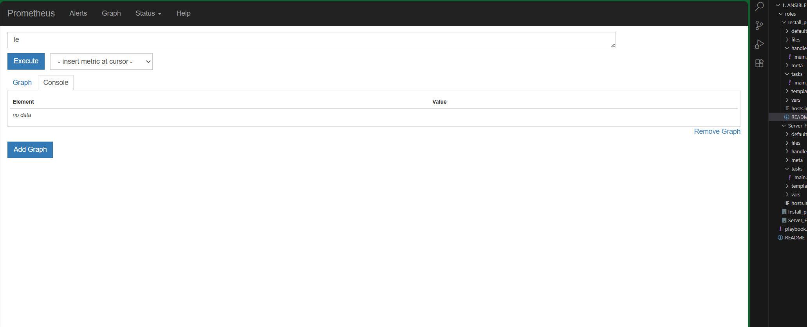

1. 🧭 Introduction
Rôle Ansible pour l’installation automatisée de Prometheus avec vérification d’intégrité, gestion du service systemd et garantie d’idempotence.

Ce rôle est conçu pour les environnements critiques où sécurité, où fiabilité et reproductibilité sont primordiales.

2. ⚙️ Fonctionnalités clés
Téléchargement dynamique de Prometheus depuis GitHub Releases

-Vérification SHA256 du binaire
-Création de l'utilisateur système dédié
-Extraction, déplacement et permissions du binaire
-Gestion du service avec systemd
-Idempotence et logique de fallback incluse

3. 📦 Variables disponibles
____________________________________________________________________________________________________________
|Variable	                    |Description	                                  |Valeur par défaut        |
|_______________________________|_________________________________________________|_________________________|
|prometheus_expected_checksum	|SHA256 attendu du binaire                        |Récupéré dynamiquement   |
|prometheus_download_url	    |URL GitHub de la release	                      |(déduite dynamiquement)  |
|prometheus_user	            |Compte système utilisé pour le service	prometheus|prometheus               |
|prometheus_bin_path	        |Chemin d’installation du binaire	              |/usr/local/bin/prometheus|

4. 📋 Exemple d’utilisation
ansible-playbook -i Install_prometheus/hosts.ini --start-at-task "Move and set permissions for Prometheus" playbook.yml -v

5. 🔐 Vérification d'intégrité
Le rôle inclut une vérification de hash avant toute installation, pour garantir que le binaire téléchargé n’a pas été altéré.

6. 🚀 Idempotence et relance
Le rôle est conçu pour être relancé sans effet de bord :

le téléchargement n’est fait que si nécessaire (fichier inexistant)

les permissions et services sont gérés proprement

une release défectueuse déclenche un fallback

7. 🖼️ Visuels et résultats
 

8. 👤 Auteur & crédits
Rôle développé dans le cadre d’une validation de compétence en automatisation. Auteur : [JeanMarc] Suivi du projet : LinkedIn | GitHub